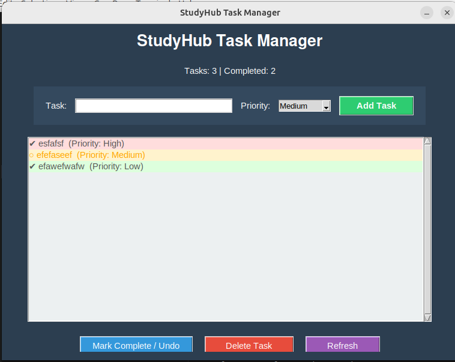

# StudyHub Task Manager

StudyHub Task Manager is a desktop application developed in Python using Tkinter.  
It provides a simple and visual way to manage daily tasks with priorities and completion status.

This project is part of an Erasmus university assignment focused on operating systems, where the application will later be extended with Docker, Snap packaging, and Ubuntu Core integration.

---

## Features

- Add tasks with different priority levels (Low, Medium, High)
- Mark tasks as completed or undo completion
- Delete tasks
- Automatic data persistence using a JSON file
- Color-coded tasks based on priority:
  - 🔴 High priority
  - 🟠 Medium priority
  - 🟢 Low priority
- Visual indication of completed tasks
- Task counter (total tasks and completed tasks)
- Clean and user-friendly graphical interface
- Scrollable task list

---

## Application Preview




---

## Project Structure
studyhub-gui
│
├── app

main.py # Main GUI application

task_manager.py # Task logic and operations

storage.py # JSON data handling

data

tasks.json # Stored tasks

├── README.md

├── requirements.txt

└── .gitignore


---

## Technologies Used

- Python 3
- Tkinter (GUI)
- JSON (data persistence)

---

## Requirements

Make sure you have Python 3 installed.

Tkinter may need to be installed separately on Linux:
 sudo apt install python3-tk

---

## How to Run the Application

1. Navigate to the project folder:
 cd studyhub-gui/app

2. Run the application:
 python3 main.py

---

## How It Works

- Tasks are stored locally in a JSON file (`tasks.json`)
- Each task contains:
  - Text
  - Priority
  - Completion status
- The interface updates dynamically after each action
- Tasks are automatically sorted by priority:
  - High → Medium → Low


## Docker

The application can also be executed inside a Docker container.


```bash
docker build -t studyhub-gui .
xhost +local:

#Run the Docker container
docker run -it \
  --rm \
  --net=host \
  -e DISPLAY=$DISPLAY \
  -e XAUTHORITY=$XAUTHORITY \
  -v /tmp/.X11-unix:/tmp/.X11-unix \
  -v $XAUTHORITY:$XAUTHORITY \
  -v $(pwd)/app/data:/app/data \
  studyhub-gui


This allows the Tkinter graphical interface to be displayed from inside the container while preserving the task data in the local app/data folder.

```bash
## Future Work
- Snap package creation
- Integration into an Ubuntu Core image for Raspberry Pi 5
